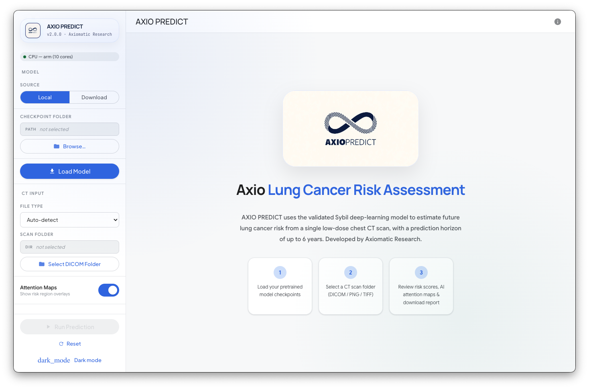
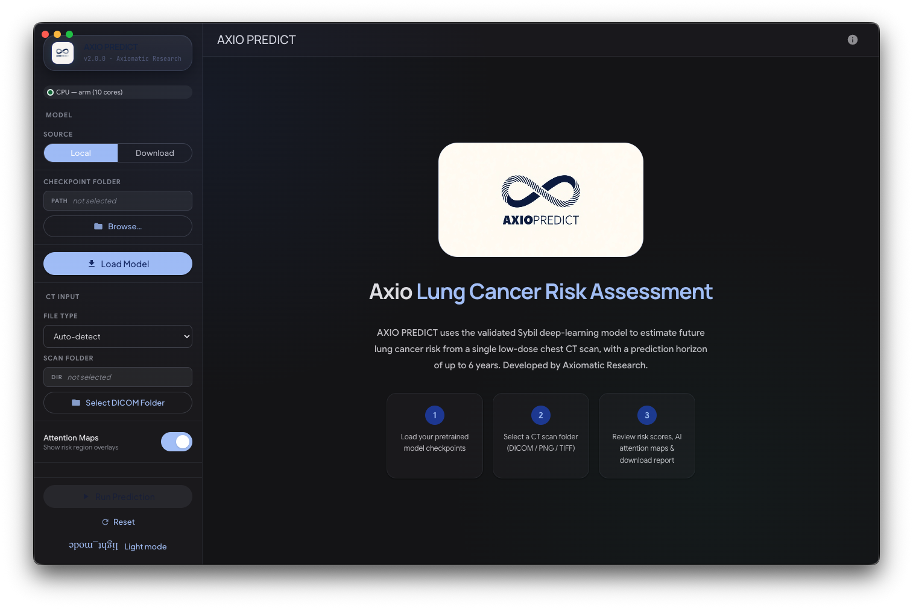
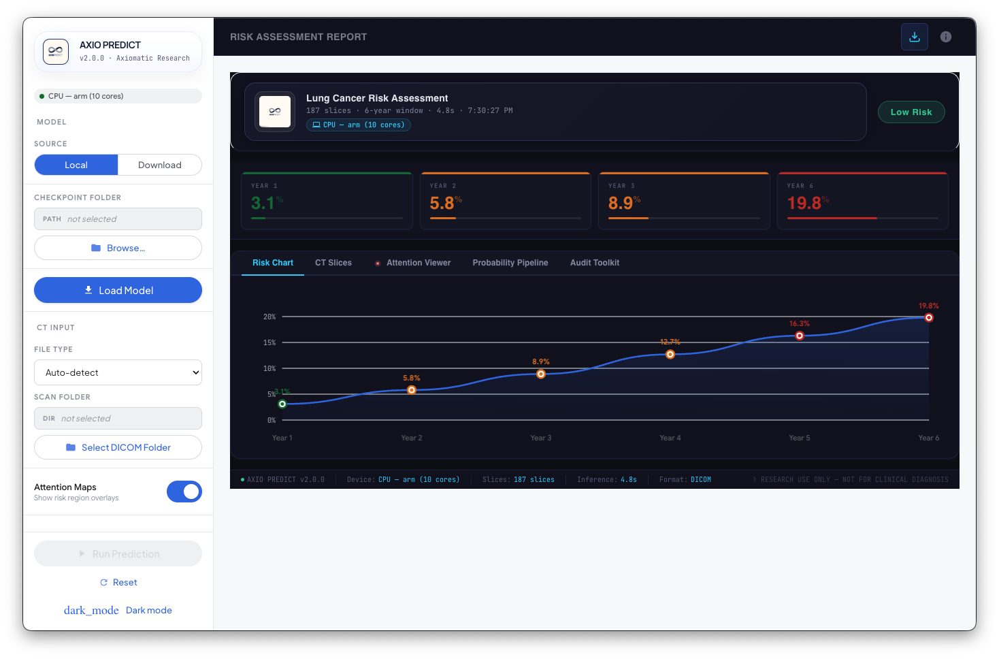
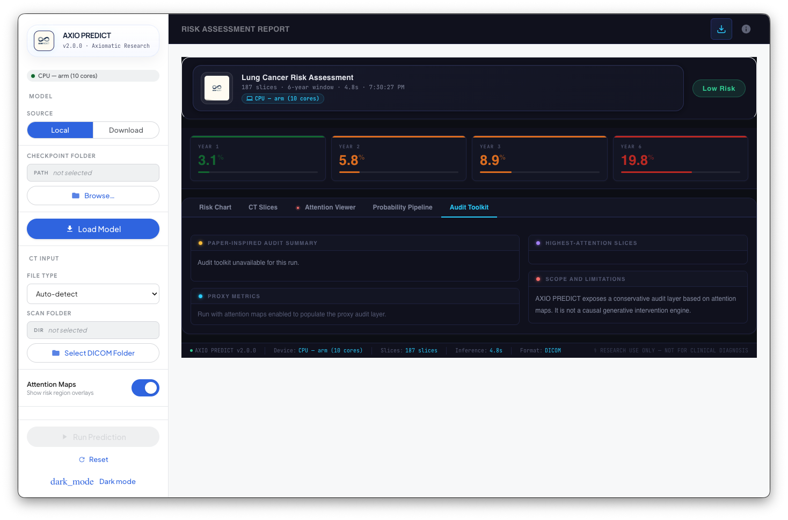

# AXIO PREDICT

> Cross-platform desktop application for lung cancer risk prediction from low-dose CT scans, powered by the Sybil v1.6.0 deep learning model.


AXIO PREDICT provides a local, privacy-preserving graphical interface for clinicians and researchers to load DICOM or PNG CT series, run the validated Sybil ensemble model, visualise attention maps, and audit prediction quality — all without sending patient data to any external server.

---

## Screenshots

| Landing screen | Dark mode |
|:-:|:-:|
|  |  |

| Risk Assessment Report | Audit Toolkit |
|:-:|:-:|
|  |  |

---

## Features

- **6-year risk scores** — calibrated probabilities of lung cancer development at 1–6 years from scan date
- **DICOM & PNG support** — axial LDCT series, auto-sorted by z-position; `.dcm`, `.dicom`, `.ima`
- **Attention map visualisation** — GIF overlays highlighting contributing slices and pixels
- **Audit Toolkit** — proxy attention diagnostics: outside-body attention, boundary dominance, peripheral-ring attention, superior/inferior asymmetry, left-right asymmetry, top-1/top-3 slice dominance
- **Local checkpoints** — model weights never leave your machine
- **Cross-platform** — macOS (Apple Silicon + Intel), Windows, Linux
- **Offline inference** — no internet required after initial model download

---

## Risk Classification

| Score | Meaning |
|-------|---------|
| Year 1–6 | Calibrated probability of lung cancer within N years |

| Level | Threshold |
|-------|-----------|
| Low | < 5% |
| Moderate | 5–15% |
| High | > 15% |

---

## Prerequisites

| Tool | Version | Purpose |
|------|---------|---------|
| Python | 3.8–3.10 | Sybil inference backend (Sybil pins `python_requires=<3.11`) |
| Node.js | ≥ 16 | Electron runtime (only needed for building from source) |
| npm | ≥ 8 | Package management (only needed for building from source) |

> **Windows users:** the installer ships an in-app setup wizard that will download and install a per-user Python 3.10.11 automatically on first launch if no compatible interpreter is found — no need to install Python yourself.

---

## Quick Start (prebuilt installer)

The fastest way to try AXIO PREDICT — no source build required.

1. Download the latest release from the [Releases page](https://github.com/godsonj64/AXIOPREDICT/releases).
   - **macOS:** `AXIO PREDICT-2.0.1-universal.dmg`
   - **Windows:** `AXIO PREDICT Setup 2.0.1.exe` (installer) or `AXIO PREDICT 2.0.1.exe` (portable)
2. Launch the app. The first run triggers the **Set up Python environment** wizard, which creates a private venv under `~/.axio_predict/` (macOS/Linux) or `%LOCALAPPDATA%\AXIO_PREDICT\` (Windows) and installs Sybil + PyTorch (5–15 minutes; downloads ~2 GB of model dependencies).
3. Download the Sybil checkpoints (see [step 4 below](#4-download-model-checkpoints)).
4. In the app: **Local Checkpoints** → browse to the checkpoints folder → **Load Model**.

---

## Installation (from source)

### 1. Clone the repository

```bash
git clone https://github.com/godsonj64/AXIOPREDICT.git
cd AXIOPREDICT
```

### 2. Set up the Python environment

**macOS / Linux:**
```bash
bash setup.sh
```

**Windows:**
```bat
setup.bat
```

This creates a `.venv/` virtual environment and installs Flask + Sybil from the bundled source.

### 3. Install Electron dependencies

```bash
cd electron_app
npm install
```

### 4. Download model checkpoints

Download the Sybil ensemble weights from one of:
- **GitHub Releases:** https://github.com/reginabarzilaygroup/Sybil/releases
- **Google Drive:** https://drive.google.com/drive/folders/1nBp05VV9mf5CfEO6W5RY4ZpcpxmPDEeR

Place all `.ckpt` files and the calibrator `.json` in a single directory, e.g.:
```
~/sybil_checkpoints/
├── 28a7cd44f5bcd3e6cc760b65c7e0d54d.ckpt
├── 56ce1a7d241dc342982f5466c4a9d7ef.ckpt
├── 624407ef8e3a2a009f9fa51f9846fe9a.ckpt
├── 64a91b25f84141d32852e75a3aec7305.ckpt
├── 65fd1f04cb4c5847d86a9ed8ba31ac1a.ckpt
└── sybil_ensemble_simple_calibrator.json
```

### 5. Run

```bash
npm start
```

In the app: choose **Local Checkpoints**, browse to your checkpoints directory, click **Load Model**.

---

## Building a Distributable

```bash
cd electron_app

# macOS (universal DMG)
npm run dist:mac

# Windows (NSIS installer)
npm run dist:win

# Linux (AppImage)
npm run dist:linux
```

The Python backend and Sybil source are bundled as `extraResources` in the packaged app.

---

## Project Structure

```
AXIOPREDICT/
├── setup.sh / setup.bat      ← environment setup
├── python_backend/
│   ├── server.py             ← Flask HTTP API wrapping Sybil
│   └── requirements.txt
├── sybil-source/             ← Sybil v1.6.0 source (unmodified)
│   └── sybil/
│       ├── model.py
│       ├── serie.py
│       ├── models/           ← SybilNet architecture
│       ├── loaders/          ← DICOM/PNG loading pipeline
│       └── utils/            ← visualisation, metrics
└── electron_app/
    ├── package.json
    └── src/
        ├── main.js           ← Electron main process, spawns Python backend
        ├── preload.js        ← secure IPC bridge
        └── index.html        ← full UI (HTML/CSS/JS, no framework)
```

---

## Audit Toolkit

AXIO PREDICT v2.0.1 adds a **paper-inspired audit toolkit** informed by the 2026 preprint *Auditing Sybil: Explaining Deep Lung Cancer Risk Prediction Through Generative Interventional Attributions*.

**Proxy diagnostics included:**
- Outside-body attention leakage
- Boundary-dominant attention
- Peripheral-ring attention
- Superior vs. inferior slice attention imbalance
- Left-right asymmetry
- Top-1 / top-3 slice dominance

**Scope:** These are non-causal proxy checks computed from existing attention maps. They are review aids, not proof of lesion-level causality. The underlying Sybil prediction path, model weights, calibration, and checkpoint handling are unchanged.

---

## Citation

If you use AXIO PREDICT in your work, please cite both this application and the underlying Sybil model.

### AXIO PREDICT

```bibtex
@software{johnson2026axiopredict,
  author    = {Johnson, Godson},
  title     = {{AXIO PREDICT}: A Desktop Application for Lung Cancer Risk
               Prediction from Low-Dose {CT} Scans},
  year      = {2026},
  version   = {2.0.1},
  url       = {https://github.com/godsonj64/AXIOPREDICT},
  license   = {MIT}
}
```

### Sybil (underlying model)

```bibtex
@article{mikhael2023sybil,
  author    = {Mikhael, Peter G and Wohlwend, Jeremy and Yala, Adam and
               Karstens, Ludvig and Xiang, Justin and Takigami, Angelo K and
               Bourgouin, Patrick P and Chan, PuiYee and Mrah, Sofiane and
               Amayri, Wael and Juan, Yu-Hsiang and Yang, Cheng-Ta and
               Wan, Yung-Liang and Balakrishnan, Guha and
               Sequist, Lecia V and Fintelmann, Florian J and Barzilay, Regina},
  title     = {Sybil: A Validated Deep Learning Model to Predict Future Lung
               Cancer Risk from a Single Low-Dose Chest Computed Tomography},
  journal   = {Journal of Clinical Oncology},
  year      = {2023},
  doi       = {10.1200/JCO.22.01345},
  publisher = {Wolters Kluwer Health}
}
```

---

## License

MIT © 2026 [Godson Johnson](https://github.com/godsonj64)

---

## Disclaimer

**FOR RESEARCH USE ONLY. Not validated for clinical diagnosis or treatment decisions. Always involve qualified medical professionals in clinical workflows.**
